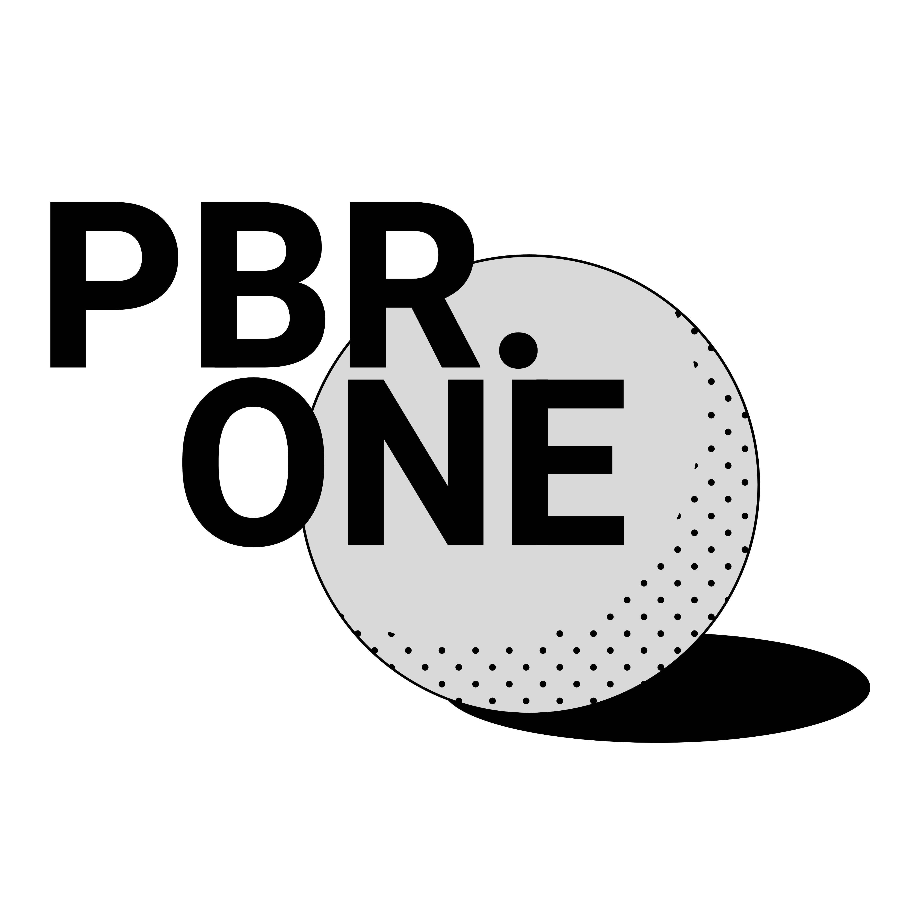

# What is PBR.ONE?
PBR.ONE is a set of HTML pages that can be embedded into any website to quickly and easily create interactive previews of digital PBR materials and HDRI environment maps right in the browser.
It was originally developed as an easy way of adding interactive previews to [ambientCG.com](https://ambientcg.com) but is now available as an open source project for everyone.

# How does it work?
The HTML pages for PBR.ONE can be viewed directly or embedded in an iframe.
Resources can be loaded by simply appending them to the URL of the page, no backend required.
Check out [this simple example](https://cdn.pbr.one/0.4.0/material-shading.html#color_url=https://pbr.one/media/bricks_col.jpg&normal_url=https://pbr.one/media/bricks_nrm.jpg&roughness_url=https://pbr.one/media/bricks_rgh.jpg&displacement_url=https://pbr.one/media/bricks_dsp.jpg&geometry_type=cylinder&displacement_scale=0.01&tiling_scale=1.33) or visit the [examples page](https://pbr.one/examples.html) to see more demos showing all of PBR.ONE's features in detail.

# How do I get started?
Visit the [documentation pages](https://docs.pbr.one) to find out how to get started. No programming knowledge required!
